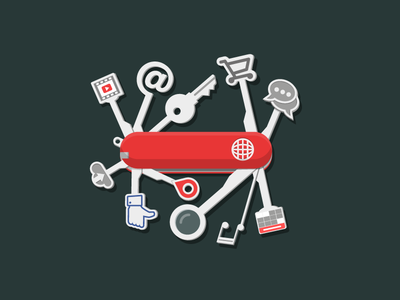

When it comes to apps and digital products, all users share a common expectation. This expectation is simplicity. Simplicity is essential nowadays, mainly because people are busy and do not have the time to read a 500 page manual on using your product. Time is too precious for that. The only exception is that the product serves an essential need in the user's life. A product such as the iphone is a perfect example. The need that the iphone serves is communication, one of the most essential primary needs of every human being. Although Apple does a very good job when it comes to making user friendly products, the iphone is undoubtedly complex. It has many bells and whistles to learn in order to use it at it's maximum potential. I personally find myself discovering a new feature on my iphone on a daily basis.

When it comes to iphone apps, we are a significantly less forgiving to the strains and aches of complexity. If I were to launch an app that could do just about anything for you in your everyday life, but was extremely  difficult to learn and use, it would not matter how amazing the app was. Most users would not use it due to a steep learning curve. This is where specialization comes in. Specialization allows you to build an amazing app, without much complexity. A specialized app normally does one, or a few things very very well (eg: Instagram and photos). Facebook, Snapchat, Instagram, Pinterest, Twitter, are all examples of apps that specialized at the beginning, when they were first starting out. As time passed, they gradually added more features. Users do not mind an app gradually adding more features, considering they are already familiar with the current version of the app. This only requires the user to learn the latest feature. If a new user tried to join the app after it has added many new features over the years, they would run into the aches and strains of complexity, just like homework piling up gradually over the week. Now you have a mountain of information to learn. I think all apps should welcome and embrace a feature that enables the users to optionally disable existing features, all the way down to the bare essentials of the app (eg: The first version of the app that was easy to learn). By giving users this option, new users will not be neglected by barrier of entry. As new users become more comfortable with the app, they can gradually enable features, just like the company gradually added them to the app.

Although Technology is becoming more awesome, it is also becoming more complex. We need to find better ways to welcome beginners in all areas and domains of Technology. I hope you enjoyed this post, have a stellar day!

Credit to [Georgy](https://dribbble.com/pashkovgs) for the awesome swiss army image.