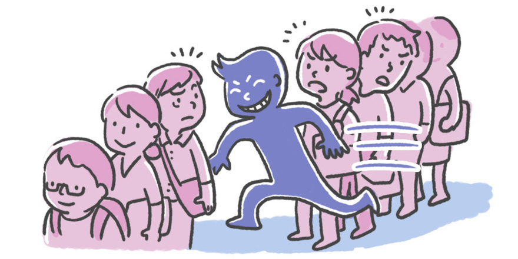

Standing in line with my pretty lady waiting to get a ticket to the The Last Jedi, a middle aged man with a disturbingly young looking face brushed past me and my date as he muttered out, "Excuse me, my friends are up there." I continued to suffer in silence as the line continued to not move an inch. As we grew closer to the ticket booth, I noticed an unusual sight. The man that brushed past us, what seemed to have been 50 years ago, was not talking to his so called "friends". Not even a little. I locked on him like a hawk the whole time we were waiting. Not a single word had been exchanged between this jerk face and his imaginary friends. Maybe they were speaking telepathically? I think not! Once we obtained our tickets, and I jumped up and down for about 3 min like a little boy who just found out he is going to Disney World, I zeroed in on the culprit and watched as he split off from the group. That lying sack of botox tricked me. Oh the utter betrayal. I probably had to be in that wretched line another .3567 seconds longer thanks to that criminal. The nerve of some people, let me tell ya. I learned a valuable lesson that day. Ask for some verification next time someone tries to join his friends ahead of you. And be sure to bring a medal detector just in case. Anyways, y'all have a rootin tootin good day!