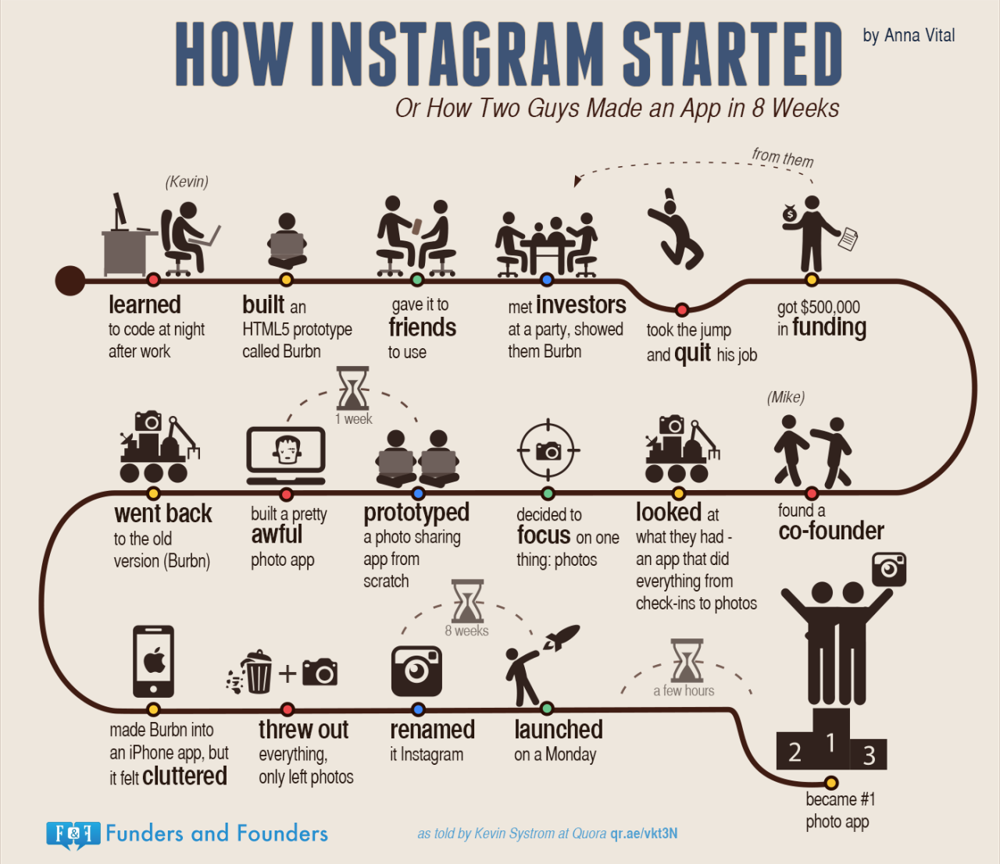

According to TechCrunch, [Instagram has recently hit 1 Billion monthly users](https://techcrunch.com/2018/06/20/instagram-1-billion-users/). For those of you who don't know, Instagram was founded by two Stanford Graduates, Kevin Systrom and Mike Kreiger, on October 6th, 2010. The app was originally called [Burbn](https://www.theatlantic.com/technology/archive/2014/07/instagram-used-to-be-called-brbn/373815/) (Kevin Systrom is a fan of bourbon). Burbn made the mistake of trying to be too many things. They relaunched as Instagram with a focus on photos.

Instagram has been continuously rising, partly due to it's new features that have obviously been taken from Snapchat's playbook. From the very start, Instagram did an exceptional job on specializing (focusing on photos).